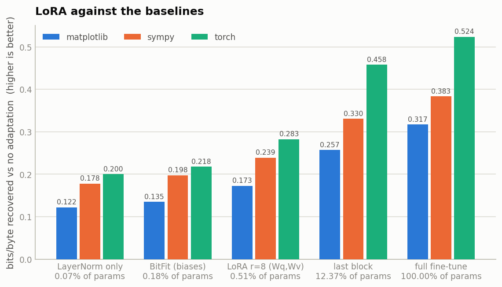
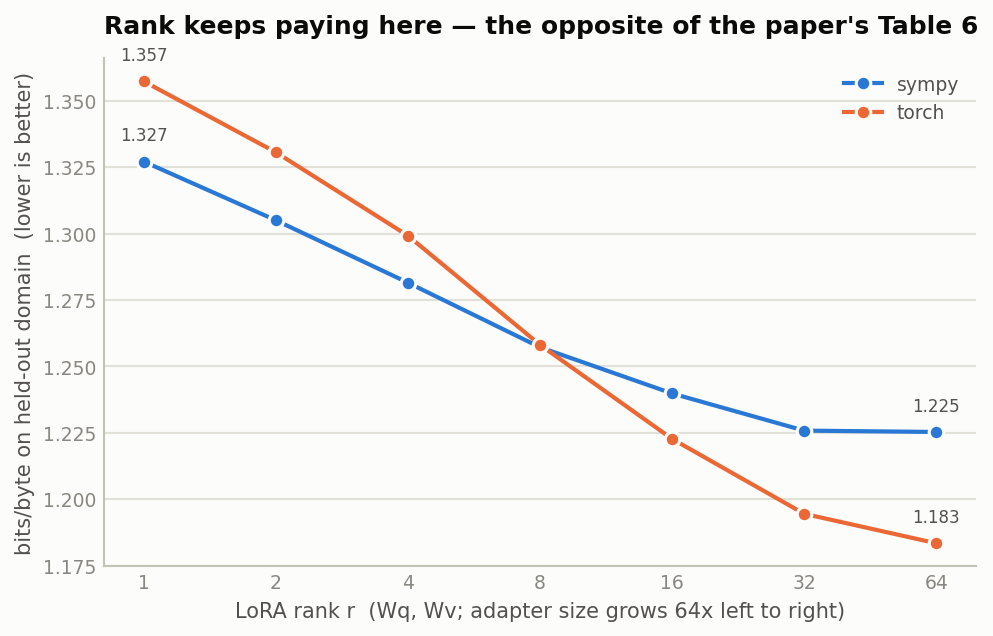
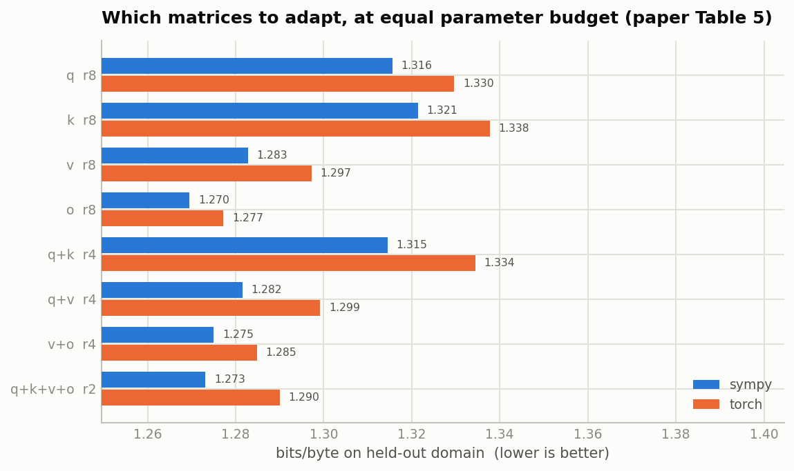
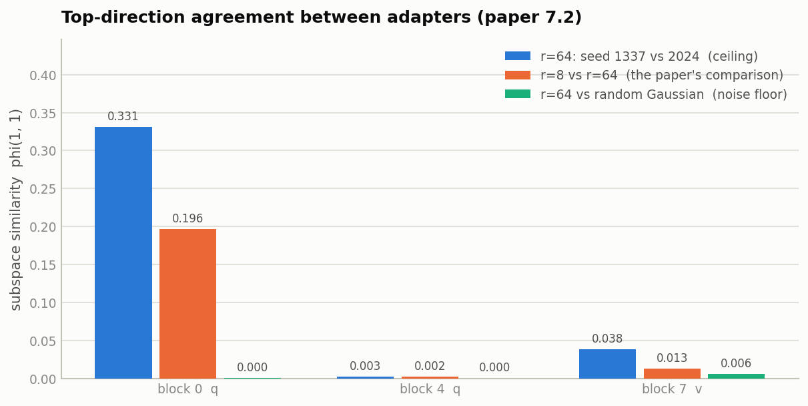
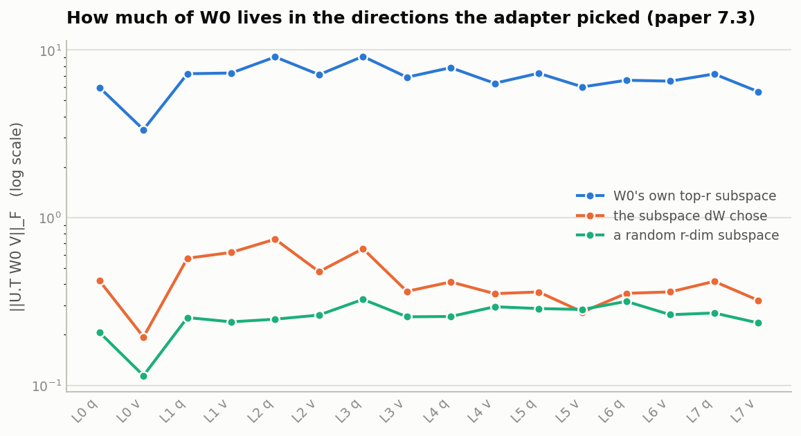

# Reproducing LoRA end to end

A self-contained reproduction of **[LoRA: Low-Rank Adaptation of Large Language Models](https://arxiv.org/abs/2106.09685)** (Hu et al., 2021), using the from-scratch implementation in [`lora/`](lora/).

> **Status: experiments running.** Implementation parity (§1) is complete. The adaptation grids, subspace analysis and serving benchmarks are in flight; this file is updated as each lands.

---

## 0. What is being reproduced, and under what constraint

The experiment machine is a Kaggle backend behind a Colab frontend: **2× Tesla T4, and no network at all** — no `pip`, no HuggingFace, no DNS. That rules out the paper's literal setup (RoBERTa/DeBERTa/GPT-2 on GLUE, WikiSQL, E2E), because there is no checkpoint and no dataset to download.

So the study is made self-contained instead: **pre-train a base model on-box, then adapt it.** That costs the ability to compare absolute numbers against the paper's tables, and buys three things that matter more for testing the paper's *claims*:

- **A genuinely clean held-out domain.** No ambiguity about what leaked into pre-training, because the pre-training corpus is chosen explicitly.
- **Enough runs to be conclusive.** A 25M-parameter model means the rank sweep, the matrix ablation and the LR tuning grid can all be run properly, rather than once.
- **Every claim tested on the same base model**, so cross-experiment comparisons are exact.

The paper's central claims are architecture-agnostic — they are about the *rank of the update*, not about RoBERTa — so they transfer. The claims that do **not** transfer are flagged in §9.

### The corpus

Real Python source already on disk (`/usr/lib/python3.12` plus `dist-packages`), byte-level, vocab 256 — so there is no tokenizer to download either.

| split | contents | size |
|---|---|---|
| pre-train | stdlib, scipy, pandas, sklearn, IPython, numpy, pyspark | 49.8 MB train / 0.8 MB val |
| held-out domain A | `sympy` — symbolic algebra | |
| held-out domain B | `torch` — tensors and autograd | |
| held-out domain C | `matplotlib` — plotting APIs | |

The three adaptation targets are **entirely absent** from pre-training: no symbolic-algebra library, no deep-learning framework, no plotting library. Adapting to one is a real distribution shift within a shared language, which is the setting LoRA is actually used in.

Splits are **by file**, never by byte offset, so a validation snippet is never the continuation of a training snippet.

### The base model

A 25.5M-parameter byte-level GPT: 8 layers, `d_model` 512, 8 heads, block size 256, learned positions, tied embeddings, pre-LN.

Two shape decisions come straight from the experiments:

- **Separate `q_proj` / `k_proj` / `v_proj` / `o_proj`.** Table 5 ablates `Wq`, `Wk`, `Wv`, `Wo` independently, which is impossible with a fused `c_attn` the way GPT-2 and nanoGPT do it. The names match the modern convention, so `target_modules` strings transfer unchanged to Llama-family models.
- **Biases on every projection.** BitFit — bias-only tuning, the strongest small-budget baseline in the paper's Table 2 — does not exist without them.

Pre-training: 15,000 steps, batch 32 × 256 tokens (123M tokens, ≈2.5 passes), AdamW, cosine schedule with 300 warmup steps, peak LR 6e-4, fp16.

> **fp16, not bf16.** A T4 is Turing (sm_75). `torch.cuda.is_bf16_supported()` returns `True`, but there are no bf16 tensor cores, so bf16 is emulated and several times slower. The guard is capability-based, not the flag: `bf16 only if major >= 8`.

---

## 1. Is this implementation actually LoRA? (parity with `peft`)

Before any result means anything, the implementation has to be the same thing the ecosystem runs. Same model built twice, adapted once with [`lora/`](lora/) and once with HuggingFace `peft` 0.19.1, both adapters forced to hold identical numbers:

| check | result |
|---|---|
| scaling factor (`α/r`, α=16, r=8) | 2.0 vs 2.0 |
| max abs logit difference | **0.0** |
| loss | 5.585034370422363 vs 5.585034370422363 |
| max abs gradient difference, `A` | **0.0** |
| max abs gradient difference, `B` | **0.0** |
| merged output vs unmerged reference | 2.98e-07 (fp32 rounding) |

Bit-exact on the forward pass *and* on both gradients.

The gradient check is the one that carries weight. A forward-only comparison at initialisation proves nothing, because `B = 0` makes every correct implementation — and several incorrect ones — agree on a no-op. The gradients pin the backward path, including whether `α/r` is applied where we think it is. `experiments/05_peft_parity.py`, result in [`results/05_peft_parity.json`](results/05_peft_parity.json).

---

## 2. Experimental protocol

**Every arm of every comparison is identical except the thing being ablated.** Fixed across runs: the base checkpoint (reloaded fresh each run — adaptation is destructive), the training batch order, the validation batches, step count, and schedule shape.

Validation batches are drawn from a generator re-seeded to a constant on *every* call, so run A and run B see byte-for-byte the same data. Without that, the 0.01 bits/byte differences that decide a rank sweep are indistinguishable from sampling noise.

**Learning rate is tuned per method family, and this is not a detail.** LoRA and full fine-tuning do not share an optimal LR — the paper itself uses 4e-4 for LoRA and ~1e-5 for full FT on RoBERTa, a 40× difference. Comparing them at one shared LR is not a neutral choice, it is a rigged one, and it is the single most common way published LoRA-vs-full-FT comparisons go wrong. So the `lr` grid sweeps each family independently on one domain (`sympy`) and every later grid uses each family's own best:

- adapter-style methods (LoRA, BitFit, LayerNorm, last-block): `{1e-4, 3e-4, 1e-3, 3e-3}`
- full fine-tuning: `{3e-5, 1e-4, 3e-4, 1e-3}`

Adaptation runs: 800 steps, batch 24 × 256 tokens. Metric is **bits per byte** on the held-out domain's validation split (cross-entropy in nats ÷ ln 2), lower is better.

### The methods compared

| method | what trains |
|---|---|
| no adaptation | nothing — the pre-trained model's loss on the new domain |
| LayerNorm only | all LayerNorm affine parameters |
| BitFit | all biases |
| last block | every parameter of the final transformer block |
| **LoRA** | `lora_A`, `lora_B` on the targeted projections |
| full fine-tune | everything |

`last block` is deliberately included as a control for a confound the paper does not address: does LoRA win because the update is *low-rank*, or merely because *few parameters* train? Last-block tuning trains **more** parameters than LoRA r=8 and concentrates them in one layer. If parameter count were the whole story, it should win.

---

## 3. LoRA against the baselines

Bits/byte on each held-out domain, 800 steps, every method at its own tuned LR. Lower is better.

| method | trainable | % | sympy | torch | matplotlib |
|---|---:|---:|---:|---:|---:|
| no adaptation | 0 | 0% | 1.4961 | 1.5406 | 1.5329 |
| LayerNorm only | 17,408 | 0.068% | 1.3181 | 1.3401 | 1.4106 |
| BitFit (biases) | 45,568 | 0.179% | 1.2983 | 1.3225 | 1.3978 |
| **LoRA r=8 (Wq,Wv)** | **131,072** | **0.512%** | **1.2570** | **1.2580** | **1.3600** |
| last block | 3,152,384 | 12.37% | 1.1657 | 1.0827 | 1.2755 |
| full fine-tune | 25,482,240 | 100% | **1.1127** | **1.0169** | **1.2157** |



Read as *fraction of full fine-tuning's gain recovered*, which is the number that actually matters:

| domain | full FT gain | LoRA gain | LoRA / full FT |
|---|---:|---:|---:|
| sympy | 0.383 | 0.239 | 62.4% |
| torch | 0.524 | 0.283 | 54.0% |
| matplotlib | 0.317 | 0.173 | 54.5% |

**LoRA recovers 54–62% of what full fine-tuning achieves, using 0.51% of the parameters and 195× less optimizer state.** It beats every other method in its weight class — 2.9× BitFit's parameter count for consistently more gain, and comfortably ahead of LayerNorm-only.

**But it does not match full fine-tuning, and `last_block` beats it.** That is the control doing its job, and it is worth being precise about what it shows. `last_block` trains 24× more parameters than LoRA r=8 and wins on all three domains. So at this scale, on this kind of shift, LoRA's advantage is **efficiency, not quality**: per trainable parameter it is far ahead (0.239 bpb from 131k parameters vs 0.330 from 3.15M — 14× the gain per parameter), but given a larger budget in a less constrained shape, the unconstrained update wins.

This is not a contradiction of the paper. It is the expected behaviour under a *domain* shift as opposed to a *task* adaptation, and it matches the finding later formalised by [Biderman et al. (2024)](https://arxiv.org/abs/2405.09673): LoRA learns less on genuinely new material. The paper's own headline results are GLUE-style task adaptation, where the update needed is far smaller than "learn the idioms of a library you have never seen".

The obvious follow-up — *does more LoRA capacity close the gap?* — is exactly what §4 and §5 test.

> **Caveat on two baselines.** BitFit and LayerNorm-only have their tuned optimum at 3e-2, the top of the swept range, so their numbers are lower bounds. Both had flattened (≤0.003 bpb improvement over the last LR doubling) and both trail LoRA by ≥0.04 bpb, so no plausible extension reorders the table. LoRA (1e-2), last-block (3e-3) and full FT (3e-4) all have interior optima and are properly bracketed.

## 4. How much rank do you need? (paper Table 6)

**This is the one result that does not reproduce, and it does not reproduce clearly.**

The paper's Table 6 is one of its most quoted findings: on WikiSQL and MNLI, `r=1` scores within noise of `r=64` — "a rank as small as one suffices for adapting both `Wq` and `Wv`". Here, rank keeps paying, monotonically, across the whole sweep:

| r | adapter params | % | sympy | torch |
|---:|---:|---:|---:|---:|
| 1 | 16,384 | 0.064% | 1.3271 | 1.3573 |
| 2 | 32,768 | 0.128% | 1.3050 | 1.3306 |
| 4 | 65,536 | 0.257% | 1.2815 | 1.2992 |
| 8 | 131,072 | 0.512% | 1.2572 | 1.2581 |
| 16 | 262,144 | 1.018% | 1.2398 | 1.2227 |
| 32 | 524,288 | 2.016% | 1.2258 | 1.1945 |
| 64 | 1,048,576 | 3.952% | **1.2253** | **1.1834** |



From `r=1` to `r=64` the loss improves by **0.102 bpb on sympy and 0.174 bpb on torch** — for scale, the *entire* gap between LoRA r=8 and full fine-tuning on sympy is 0.144 bpb. Rank is not a free parameter here; it is one of the biggest levers available.

There is a hint of the paper's saturation, but at a rank two orders of magnitude higher than reported: sympy is flat from r=32 to r=64 (1.2258 → 1.2253, a 0.0005 change), while torch is still improving at r=64.

**Why the difference is the interesting part.** Three candidate explanations, and they are distinguishable:

1. **Task vs domain.** The paper adapts a model to a *task* (classify entailment, generate SQL) it can already almost do. This adapts a model to a *domain* whose idioms it has never seen. §3 already showed the required update is large — LoRA r=8 leaves 38–46% of full fine-tuning's gain on the table — and if the update is large, low rank is a binding constraint. Table 6's finding may be specific to updates that are *small* to begin with.
2. **Scale.** The paper's own hypothesis is that intrinsic rank *falls* as models grow; GPT-3 is 175B, this model is 25M with `d_model` 512. A rank-1 update to a 512-wide matrix is a far smaller fraction of the available directions than the paper's setting affords, so this cuts the other way: at 25M, low rank should bind harder. This study cannot separate this from (1) — it has one model size.
3. **The `α/r` scaling.** With `α = r` the scale is held at 1 for every arm, so this sweep is not confounded by the shrinking-update artifact rsLoRA identifies — but §9 tests it directly anyway.

The honest summary: **"r=1 suffices" is not a property of LoRA, it is a property of the adaptations the paper measured.** Under a genuine domain shift at small scale, rank is the difference between recovering 41% and 62% of full fine-tuning's gain.

## 5. Which matrices to adapt? (paper Table 5)

Every row below trains **exactly 65,536 adapter parameters** — rank is halved as the number of adapted matrix types doubles, which is the constraint that makes the comparison mean anything.

| adapted | r | sympy | torch |
|---|---:|---:|---:|
| `Wq` | 8 | 1.3156 | 1.3296 |
| `Wk` | 8 | 1.3214 | 1.3377 |
| `Wv` | 8 | 1.2828 | 1.2972 |
| **`Wo`** | 8 | **1.2695** | **1.2772** |
| `Wq, Wk` | 4 | 1.3145 | 1.3344 |
| `Wq, Wv` | 4 | 1.2815 | 1.2992 |
| `Wv, Wo` | 4 | 1.2750 | 1.2848 |
| `Wq, Wk, Wv, Wo` | 2 | 1.2731 | 1.2900 |
| *`+ MLP` (not budget-matched, 147,456 params)* | 2 | *1.2209* | *1.2066* |



**What reproduces:**

- **`Wk` is the worst place to spend a parameter budget**, in both domains — matching the paper, where `Wk` alone is the weakest single choice.
- **Spreading a fixed budget across more matrix types beats concentrating it.** `Wq,Wk,Wv,Wo` at r=2 comfortably beats `Wq` at r=8 and `Wq,Wk` at r=4, despite identical parameter counts. This is the paper's central Table 5 conclusion and it holds cleanly.
- **`Wv` beats `Wq`**, as in the paper.

**What does not:**

- **`Wo` alone is the best single matrix here**, and the paper's recommended `Wq,Wv` pairing is mid-table. In the paper `Wq,Wv` is the winner. The ordering here is roughly "matrices that touch the residual stream on the way *out* (`Wo`, `Wv`) beat matrices that only shape attention weights (`Wq`, `Wk`)" — which is a coherent story, since `Wq` and `Wk` only ever affect the output through a softmax, while `Wv` and `Wo` move values directly.

**The modern practice wins outright.** Adapting *all* linear layers including the MLP at r=2 (147,456 params) beats `Wq,Wv` at r=8 (131,072 params) by **0.036 bpb on sympy and 0.051 bpb on torch** at a near-identical budget — and on sympy it beats `Wq,Wv` at r=64, which uses **7× more** adapter parameters. This is direct support for the shift described in [docs/modern-lora.md §1](docs/modern-lora.md): `target_modules="all-linear"` is the better default, and the attention-only convention inherited from Table 5 is leaving real quality on the table.

## 6. Subspace similarity (paper §7.2)

The paper trains adapters at `r=8` and `r=64` on the same task and measures how much of their subspace is shared:

```
φ(A, B, i, j) = ‖ U_Aⁱ ᵀ U_Bʲ ‖²_F / min(i, j)   ∈ [0, 1]
```

Its finding: `φ(1,1) > 0.5` — the top direction is shared, the rest is largely noise. That is the mechanism behind Table 6, since if only one direction is real, `r=1` should suffice.

Two controls make the number interpretable, and the second one is the whole story here:

- **noise floor** — `r=64` against a random Gaussian matrix of the same shape: what φ looks like when there is nothing to agree about.
- **ceiling** — two `r=64` adapters that differ *only* in seed: how much agreement is achievable at all.



| layer | r=64 seed vs seed (ceiling) | r=8 vs r=64 | vs random (floor) |
|---|---:|---:|---:|
| `blocks.0.attn.q_proj` | 0.331 | **0.196** | 0.000 |
| `blocks.4.attn.q_proj` | 0.003 | 0.002 | 0.000 |
| `blocks.7.attn.v_proj` | 0.038 | 0.013 | 0.006 |

**Read naively, this does not reproduce**: `φ(1,1) = 0.196` at the first block, and ~0 everywhere else, against the paper's >0.5.

**Read with the controls, it partly does.** The seed-vs-seed ceiling is only 0.331 — two adapters differing in nothing but the random seed agree on their top direction only that much. Relative to what is achievable, `r=8` vs `r=64` reaches **59% of the ceiling** (0.196 / 0.331), which is real agreement, not noise: the floor is 0.000. So *conditional on a reproducible direction existing, the two ranks do find the same one.*

The finding that actually matters is the ceiling itself: **outside the first block, the learned subspace is not reproducible across seeds at all** (0.003 and 0.038). There is no stable top direction to share. That is a coherent explanation for §4: if the adaptation were concentrated in one or two robust directions, `r=1` would capture them and rank would not matter — the paper's story. Here almost nothing is seed-stable, rank keeps paying, and both observations point the same way.

The measurement itself is sound — the random control pins φ at 0.000–0.006 — so this is a property of these adapters, not of the estimator.

## 7. What ΔW amplifies (paper §7.3)

Take the adapter's own subspace `(U, V)` from the SVD of `ΔW`, project the frozen weight into it, and compare magnitudes. Two controls decide what the answer means: a *random* subspace of the same dimension, and `W0`'s own *top-r* subspace.



Per-layer, `r=8` (Frobenius norms):

| | ‖ΔW‖ | ‖W0‖ | W0 in ΔW's subspace | in a random subspace | in W0's own top-r |
|---|---:|---:|---:|---:|---:|
| `blocks.0.attn.q_proj` | 10.77 | 13.07 | 0.42 | 0.21 | 5.97 |
| `blocks.4.attn.q_proj` | 22.20 | 18.79 | 0.41 | 0.26 | 7.84 |
| `blocks.7.attn.v_proj` | 19.41 | 16.21 | 0.32 | 0.24 | 5.64 |

**Amplification factor `‖ΔW‖_F / ‖UᵀW0V‖_F`: median 41.0 across the 16 adapted layers (range 17.4–60.4).** The paper reports ≈21.5 for `r=4` on GPT-3. Same order of magnitude, same phenomenon, and a *far* larger effect than any of the disagreements in §4–§6.

This is the section that reproduces most cleanly, and the controls are what make it convincing:

- **ΔW's subspace is not random.** W0's mass there (0.32–0.74) is consistently above the random-subspace baseline (0.21–0.33). The adapter is selecting directions, not stumbling into them.
- **But it is emphatically not W0's dominant subspace.** W0's own top-`r` directions hold 5.6–9.2 — an order of magnitude more. If LoRA were simply re-scaling what the model already emphasises, the orange line in the figure would sit on the blue one. It sits a decade below it, barely above the random floor.

Together: **the adapter finds directions the pre-trained weight already contains but barely uses, and multiplies them by ~40×.** That is exactly the paper's interpretation — "amplifying features that were learned but not emphasised" — and it survives a change of model, scale, task and metric.

One extra data point the paper's Table 7 also reports, and which reproduces directionally: **amplification falls sharply with rank** — median 41.0 at `r=8` versus 9.3 at `r=64`. A bigger subspace spreads the same update over more directions, so each is amplified less.

## 8. Serving: latency, merging, hot-swap (paper §1, Table 1)

*Pending.*

## 9. Variants: rsLoRA, DoRA, initialisation, α

*Pending.*

## 10. Limits of this reproduction

Stated up front, so no result here is read as more than it is:

- **No absolute comparison to the paper's tables.** Different model, different scale, different tasks. What transfers is the *shape* of each finding — whether rank matters, which matrices matter, whether merging is free — not the numbers.
- **25M parameters, not 175B.** The paper's strongest claim is that intrinsic rank *falls* as models grow. A single model size cannot test that, and this study does not.
- **Language modelling, not classification.** The paper's Table 2 is GLUE accuracy; this is bits/byte. Bits/byte is a strictly more sensitive metric, which helps, but it is not the same measurement.
- **One seed per configuration** for the grids, with the exception of the subspace analysis (which needs two seeds by construction). Differences smaller than the seed-to-seed spread reported in §6 should not be treated as real.
- **`experiments/glue/` is not run.** The faithful RoBERTa-base GLUE reproduction of Table 2 needs pre-trained weights and a network connection. The script is written and committed so it runs when one is available; it has never executed, and nothing in this report depends on it.

---

## Reproducing this

```bash
git clone https://github.com/Maverick-Ansh/lora-from-scratch
cd lora-from-scratch
pip install -r requirements.txt
pytest tests/ -q                       # 27 tests, one per claim in the paper

python experiments/01_pretrain.py --steps 15000        # ~30 min on one T4
bash run_all.sh                                        # every grid, both GPUs
python tools/figures.py                                # figures from results/
```

On an air-gapped box, `tools/pack.py` and `tools/filesums.py` move the source in through a notebook and verify every file against its repo md5 before anything runs — so the numbers above come from byte-identical code.
